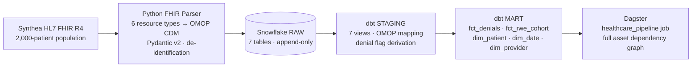
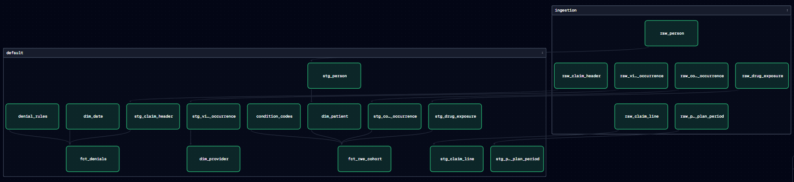

# Denied: Healthcare Claims Intelligence Pipeline

[](https://github.com/ericg1212/healthcare-claims-pipeline/actions/workflows/ci.yml)
[](https://github.com/ericg1212/healthcare-claims-pipeline/actions/workflows/codeql.yml)
[](https://codecov.io/gh/ericg1212/healthcare-claims-pipeline)
[](https://github.com/ericg1212/healthcare-claims-pipeline/releases)
[](https://ericg1212.github.io/healthcare-claims-pipeline/)


**By [Eric Grynspan](https://www.linkedin.com/in/ericgrynspan/)** &nbsp;·&nbsp; [dbt Docs](https://ericg1212.github.io/healthcare-claims-pipeline/) &nbsp;·&nbsp; [Trust but Verify →](https://github.com/ericg1212/ai-healthcare-pipeline)

---

Denied classified denials retrospectively. Trust but Verify adds AI governance. Cleared prevents the denial before it happens.

| Pipeline | Focus | Status |
|---|---|---|
| **[Denied *(this project)*](https://github.com/ericg1212/healthcare-claims-pipeline)** | Retrospective denial classification — separate 27K systematic denials with an upstream fix from 229K documentation failures requiring a different intervention | Live |
| [Trust but Verify](https://github.com/ericg1212/ai-healthcare-pipeline) | Clinical AI governance — LLM enrichment + rules engine cross-validation, every routing decision explainable | Live |
| [Cleared](https://github.com/ericg1212/agentic-rcm-pipeline) | Real-time prior auth prevention — in-memory payer criteria matching at point of submission, streaming ingestion | Live |

---

**Denied.** Not every denied claim is a rework opportunity — and not all denials are the same problem. This pipeline delivers two outputs from one infrastructure: CARC-level denial attribution across 257K claims that separates systematic denials from documentation failures (RCM), and a T2D+CKD metformin utilization cohort that connects the same claims data to clinical drug utilization signals (RWE).

CMS-0057-F mandates that payers respond to prior authorization requests within 72 hours for urgent cases and 7 days for standard — creating immediate downstream pressure on providers to submit complete, well-documented claims or face accelerating denial rates. CARC 197 (prior-auth gaps) is exactly the category this regulation targets.

---

## Findings: 495,412 Claims, 51.9% Denial Rate, $1.2M+ Recoverable

CARC 197 and 96 are systematic denials — prior-auth and formulary gaps, each with a single upstream fix. CARC 16 at 89.3% is a documentation quality problem that cuts across all claim types.

| Queue | CARC | Denial Reason | Claim Count | Share of Denials |
|-------|------|---------------|-------------|-----------------|
| Telehealth prior-auth | 197 | Non-covered charge — renal dialysis / telehealth not under plan | 3,700 | 1.4% |
| Medicaid pharmacy formulary | 96 | Non-covered charge — drug not on Medicaid formulary | 23,900 | 9.3% |
| Documentation gaps | 16 | Claim lacks information to adjudicate | 229,400 | 89.3% |
| **Total denied** | | | **257,000** | **51.9% denial rate** |

**Insight:** CARC 197 and 96 together represent ~27,600 systematic denials — claims where the denial pattern is deterministic and the fix is upstream of submission, not in the claim itself. CARC 16 at 89% signals a documentation and submission quality problem. The pipeline classifies every denial into one of these two work queues at the CARC level. At average reimbursement rates, the recoverable systematic denial pool represents **$1.2M+ in reclaimable revenue** — the portion with a defined upstream fix and a clear ROI case for intervention.

> **On the 51.9% denial rate:** Real-world rates run 5–15%. The elevated figure reflects Synthea's broad payer simulation across Medicaid, commercial, and self-pay — a simulation artifact. The CARC attribution methodology applies identically at production volumes.

---

## Architecture



### FHIR Resource Mapping

| FHIR Resource | OMOP CDM Target |
|---|---|
| Patient | PERSON |
| Encounter | VISIT_OCCURRENCE |
| Condition | CONDITION_OCCURRENCE (ICD-10 + SNOMED) |
| MedicationRequest | DRUG_EXPOSURE (RxNorm) |
| ExplanationOfBenefit | CLAIM_HEADER + CLAIM_LINE |
| Coverage | PAYER_PLAN_PERIOD |

Pydantic v2 validation and de-identification run at the FHIR parser boundary before any data reaches Snowflake.

### Dagster Asset Graph



---

## Two Different Problems, Two Different Fixes

257,000 denials aren't one problem. CARC 197 and 96 are systematic — same trigger, same code, deterministic upstream fix. CARC 16 at 89% is a documentation quality problem that requires a workflow audit, not a rework queue.

| CARC | Type | Root Cause | Fix |
|------|------|------------|-----|
| 197 | Systematic | PA reference number absent on covered telehealth/renal dialysis claims | Enforce PA number as required field at claim submission |
| 96 | Systematic | Medicaid formulary conflict caught at adjudication instead of prescribing | Move formulary check upstream to point of prescribing |
| 16 | Documentation | Catch-all — missing notes, wrong modifiers, credentialing mismatches | Submission quality audit to identify dominant subtype; workflow fix at encounter close |

**CARC 16 root causes and mitigations:**

| Root Cause | Mitigation |
|------------|------------|
| Missing PA reference on authorized claims | PA number required field at claim creation |
| Missing medical necessity documentation | Enforce note completion at encounter close before billing |
| Incorrect CPT modifiers (e.g., -95 absent on telehealth) | Automated modifier scrub at claim creation |
| Missing referring provider NPI / referral docs | Referral ID required in visit record, linked to scheduling |
| Rendering provider credentialing mismatch | Real-time payer roster check; 90/60/30-day re-credentialing alerts |

---

## RWE: Same Data, Second Question

The same OMOP layer answers a second question without rebuilding the pipeline: are the right patients getting the right drugs? ADA guidelines name metformin first-line for T2D, but CKD complicates dosing at eGFR thresholds — a clinically significant gap where underprescription is common.

**T2D + CKD Metformin Utilization (104-patient cohort)**

| Metric | Value |
|--------|-------|
| Cohort size (T2D + CKD) | 104 patients |
| On metformin | 57 (54.8%) |
| Not on metformin | 47 (45.2%) |

A 45.2% gap is a meaningful signal, not a concluded finding — the starting point for stratification by CKD stage, eGFR band, payer, and age. Adding a new cohort requires one row in `seeds/condition_codes.csv`, no SQL changes.

---

## Design Decisions

| Decision | Why |
|---|---|
| **OMOP CDM** | FDA/NIH/OHDSI standard — the RWE methodology reproduces against any OMOP dataset, not just this pipeline |
| **Seed-based CARC attribution** | Synthea emits FHIR, not X12 835 remittances — attribution rules live in a seed CSV; a real 835 feed replaces the seed, mart SQL unchanged |
| **Externalized condition codes** | A new RWE cohort is a seed row, not a model rewrite — clinical knowledge stays out of SQL |
| **DuckDB for dev + CI** | Identical SQL dialect locally and in GitHub Actions at zero cost — no Snowflake credits in CI |
| **Pydantic at the parser boundary** | Malformed FHIR raises at parse time, not silently downstream in the mart layer |
| **`TRANSFORMER` role** | Least-privilege — dbt never touches `ACCOUNTADMIN`; the required pattern in HIPAA-adjacent environments |
| **Dagster over Airflow** | Software-defined assets describe data lineage, not just execution order — asset-level re-runs, native lineage graph |
| **No intermediate dbt layer** | Staging views share no business logic — an intermediate layer adds materialization cost with no clarity gain |
| **RxNorm IDs for metformin** | `LIKE '%metformin%'` false-positives on combination therapies; concept IDs are exact and reproducible |

---

## Stack

| Layer | Technology | Role |
|-------|-----------|------|
| Data generation | Synthea 3.x (Java) | Synthetic HL7 FHIR R4 population (simulates EHR-originated payloads) — PHI-free by design |
| Ingestion | Python 3.13 + Pydantic v2 | EHR-originated HL7 FHIR R4 parser, OMOP mapping, de-identification |
| Storage | Snowflake | RAW, STAGING, MART schemas; TRANSFORMER role |
| Transformation | dbt 1.10 + dbt-snowflake | 12 models, 2 seeds, 83 tests |
| Orchestration | Dagster 1.13 | Multi-asset pipeline, full dependency graph |
| CI | GitHub Actions (SHA-pinned) | lint (flake8 + bandit + pip-audit), pytest, dbt compile |
| Dev adapter | dbt-duckdb | Zero-cost local dev and CI — no Snowflake credits in CI |
| Security | TRANSFORMER role, SECURITY.md, Dependabot, secret scanning | Least-privilege, supply chain and credential protection |

---

## Data Model

### Staging layer (views — always fresh, zero storage)

Seven OMOP CDM staging views clean and type-coerce the RAW tables. The denial flag is derived at this layer: a claim is denied when `is_insured = true AND submitted_amount > 0 AND payment_amount = 0`. `NO_INSURANCE` (Synthea self-pay) is explicitly excluded — a zero payment on an uninsured claim is patient responsibility, not a payer denial.

### Mart layer (tables — pre-computed for BI queries)

`fct_denials` applies CARC attribution from `seeds/denial_rules.csv` — adding a new denial rule requires one CSV row, no SQL changes. `fct_rwe_cohort` identifies the T2D+CKD cohort by joining `seeds/condition_codes.csv` against OMOP condition records — adding a new cohort definition requires adding rows to the seed, not editing model SQL. Both seeds externalize clinical knowledge from transformation logic.

### dbt tests

83 tests across 12 models: `not_null`, `unique`, `accepted_values`, `relationships`. Every primary key, every foreign key, every categorical field is tested. The `accepted_values` test on `carc_code` (`'197'`, `'96'`, `'16'`) and `denial_type` (`'systematic'`, `'random'`) ensures CARC attribution logic never silently produces invalid output.

---

## Testing

```bash
make test
# pytest: 40 tests — parser utilities, edge cases, denial flag derivation
# dbt compile: validates all 12 models + 2 seeds resolve without errors
```

pytest covers `extract_uuid`, `parse_datetime`, `hash_id`, `get_coding`, `is_insured`, and `derive_denial_flag` with parametrized inputs including boundary values, null handling, and malformed FHIR references.

---

## Project Structure

```
healthcare-claims-pipeline/
├── synthea_parser/      # FHIR → OMOP parser (6 resource types) · de-identification
├── scripts/             # Snowflake bulk load, fixtures, connection factory
├── dbt_project/         # 7 staging views + 5 mart tables · 2 externalized seeds
├── dagster_pipelines/   # raw_claims_load multi_asset + dbt assets, one pipeline job
├── tests/               # 40 pytest tests — parser utils, edge cases
└── Makefile             # generate, load-snowflake, dbt-snowflake, dagster, test
```

---

## Quickstart

Requires Python 3.13, Java 17+ (Synthea), and a Snowflake account with a `TRANSFORMER` role (`SYNTHEA` JAR path configurable in the Makefile).

```bash
cp .env.example .env             # SNOWFLAKE_ACCOUNT, SNOWFLAKE_USER, SNOWFLAKE_PASSWORD
pip install -r requirements.txt
make generate                    # 2,000-patient FHIR population
make load-snowflake              # schema + fixture load (first time only)
python scripts/load_to_snowflake.py --fhir-dir data/synthea_output
make dbt-snowflake               # run transformations
make dagster                     # localhost:3000 → healthcare_pipeline → Launch run
```

Dev mode — no Snowflake, no credits:

```bash
make dbt-dev    # identical SQL against local DuckDB
make test       # pytest + dbt compile
```

---

## HIPAA Note

This pipeline uses **Synthea synthetic data** — 100% generated, zero real PHI. The de-identification boundary is enforced at the FHIR parser layer (`synthea_parser/utils.py::hash_id`) before any data reaches storage. In a production deployment with real patient data, this is where the BAA starts: identifiers are hashed at ingestion, day-level birth precision is stripped to year, and all downstream storage operates on de-identified OMOP fields. Snowflake access uses a least-privilege `TRANSFORMER` role — no `ACCOUNTADMIN` in the transformation path.
